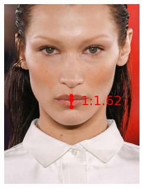
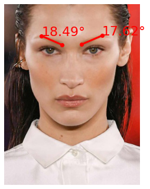
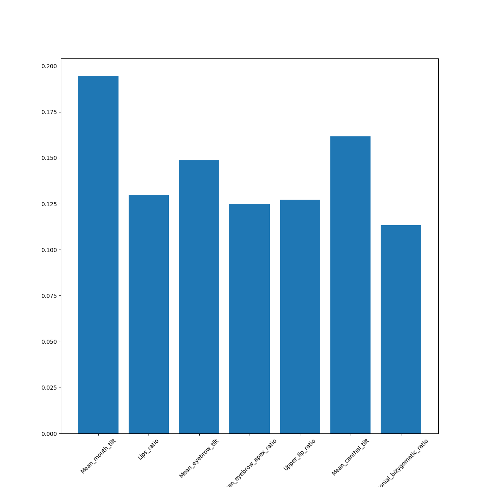
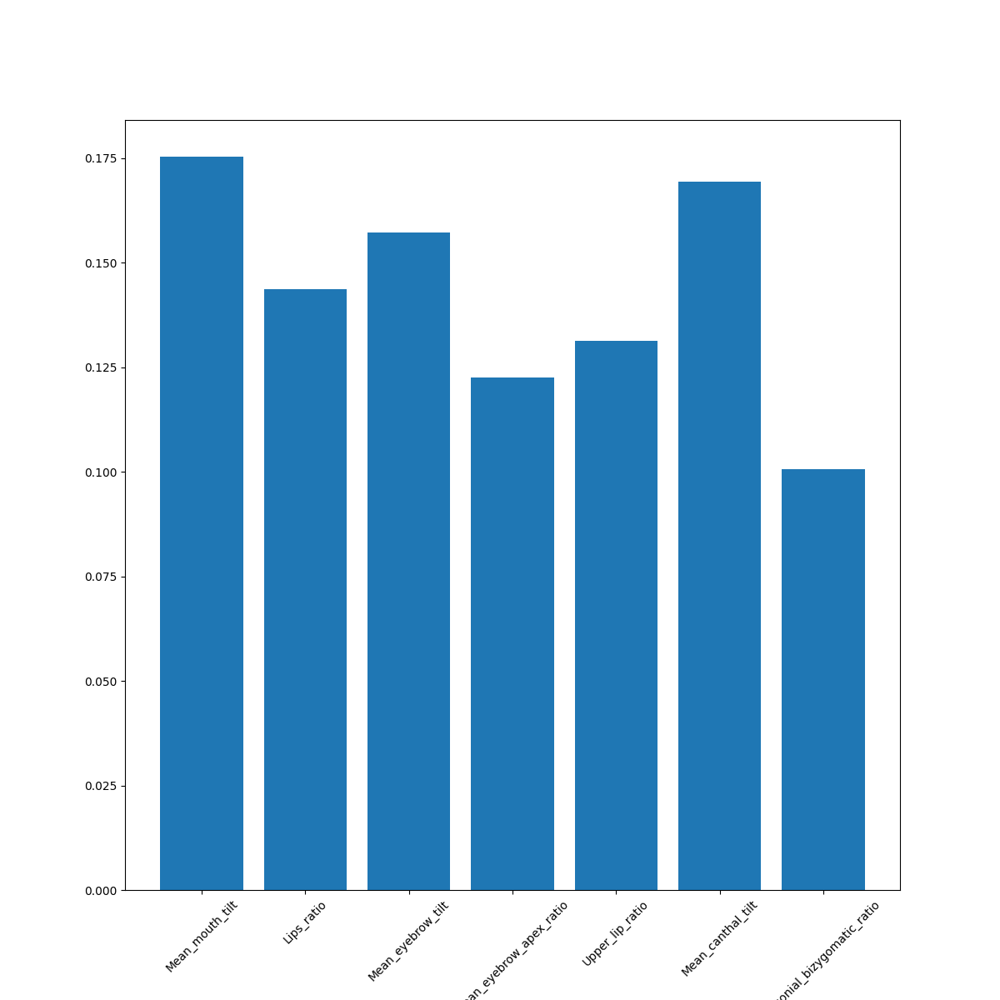
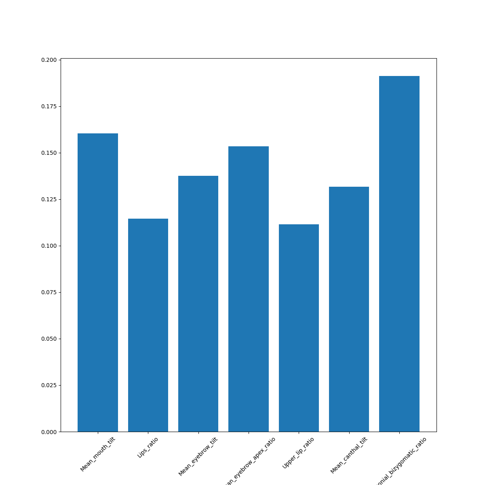
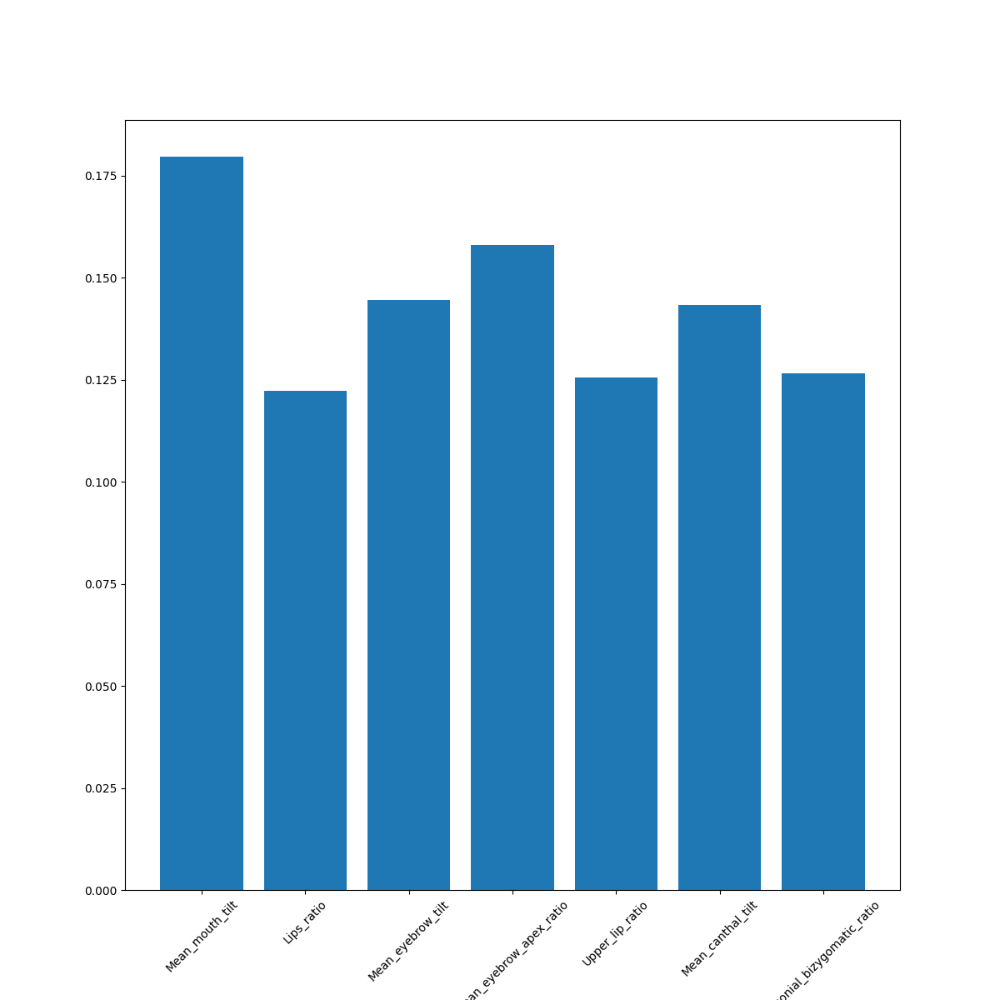

# Facial Features Attractiveness Analysis

## Table of Contents

- [Introduction](#introduction)
- [Dataset](#dataset)
- [Methodology](#methodology)
- [Results](#results)
- [Future Plans](#future plans)
- [Contact](#contact)

---

## Introduction

The **Facial Features Attractiveness Analysis** project aims to identify which facial features influence facial attractiveness the most. Facial attractiveness is a complex and subjective trait that varies across different individuals, genders, and races. This project utilizes the SCUT-FBP5500_v2.1 dataset and a set of facial features to analyze and understand the factors contributing to facial attractiveness.

## Dataset

The primary dataset used in this project is the **[SCUT-FBP5500_v2.1](https://drive.google.com/file/d/1w0TorBfTIqbquQVd6k3h_77ypnrvfGwf/view)** dataset. This dataset contains a diverse collection of facial images, along with attractiveness scores. The dataset is split by gender and race, allowing us to analyze attractiveness factors within these categories.

### Features Extracted

Several facial features were extracted from the dataset for analysis, including but not limited to:

- Lips ratio
  
  
- Medial angle of eyebrows

  
  

- Other facial features you can see in [notebook](notebooks/Facial_features.ipynb)

## Methodology

The analysis can be summarized in the following steps:

1. **Data Collection**: The SCUT-FBP5500_v2.1 dataset was obtained, containing facial images and attractiveness scores.

2. **Feature Extraction**: Various facial features were extracted from the images using computer vision techniques.

3. **Data Split**: The dataset was split into subsets based on gender and race to perform gender and race-specific analysis.

4. **Random Forest Classifier**: A Random Forest Classifier `feature_importances_` was used to determine the most important facial features that influence attractiveness within each subset.

5. **Results Interpretation**: The results were analyzed to identify which features have the most significant impact on facial attractiveness.

## Results

Here are some sample visualizations of the results:

- Asian females facial features importance:

- Asian males facial features importance:

- Caucasian females facial features importance:

- Caucasian males facial features importance:

For a comprehensive analysis and more detailed results, please refer to the project documentation and code.

## Future plans
- Add more measurable features for investigation
- Expand the dataset to provide a wider range of ideas about the attractiveness diversity of the human face
- Try other interpretable techniques for identifying feature importance

## Contact

For any questions or inquiries, please feel free to contact:

**Dzmitry Kudrytski**
- Email: [kudrikmed@gmail.com](kudrikmed@gmail.com)

Your feedback and contributions to this project are highly appreciated.